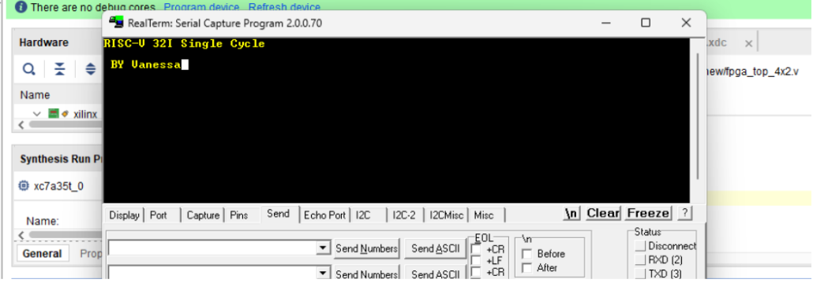

RV32I Single-Cycle CPU for Tiny Tapeout — tt_um_vanessa_riscv

Overview

tt_um_vanessa_riscv is a single-cycle RISC-V (RV32I) CPU designed for fabrication on a Tiny Tapeout shuttle on the SKY130 process. Because Tiny Tapeout's tile size limits the on-chip instruction memory to 8 physical words, the design uses a block-chained loading scheme: programs larger than 8 instructions are streamed over SPI in 8-word blocks, each block ending in a jump back into the SPI-loading state, so the CPU can run full programs of 24–40 instructions without needing a larger physical memory array.

The design has been verified at three levels: a cycle-accurate Python model, real hardware on a Digilent Basys3 FPGA (Vivado + RealTerm over UART), and the post-synthesis/post-layout netlist produced by the LibreLane/OpenLane hardening flow targeting SKY130.

Academic Motivation

Project Objectives
Design a functional RV32I single-cycle CPU that fits Tiny Tapeout's area constraints.
Prove mutual exclusion between the CPU's execution FSM and the SPI block-loading FSM, so the instruction memory is never read and written in the same cycle.
Validate full RV32I base-ISA coverage (30/30 instructions) despite an 8-word physical instruction memory, via block-chaining.
Repackage and validate 10 category test programs (A, B, C, D, D2, E, F2, G, H_suma, H_resta) on real FPGA hardware, not only in simulation.
Produce a clean, fabrication-ready GDS (SKY130, LibreLane/OpenLane) with the pin assignment verified against Tiny Tapeout's own specification.
Project Summary
Item	Value
Top module	tt_um_vanessa_riscv
Process	SKY130 (sky130_fd_sc_hd)
Target	Tiny Tapeout digital ASIC shuttle
Tile size	4x2
Design type	Digital — RV32I single-cycle CPU, SPI-loaded block-chained memory
Implementation style	Standard-cell digital synthesis (LibreLane/OpenLane: Yosys + OpenROAD)
Core supply	1.8 V
I/O supply	3.3 V
Clock	10 MHz (CLK_FREQ_HZ = 10_000_000)
UART baud rate	115200 bps
Physical instruction memory	8 words (INSTR_DEPTH = 8), block-chained over SPI
ISA coverage	RV32I base integer ISA — 30/30 instructions verified
UART pinout	ui_in[3] = RX, uo_out[4] = TX (TT UART-to-USB, Option 1)
SPI pinout	uio[0]=CS, uio[1]=MOSI, uio[2]=MISO, uio[3]=SCK
Die area	682.64 × 225.76 µm² (DIE_AREA in config.json, fixed 4x2 tile)
Placement target density	76% (PL_TARGET_DENSITY_PCT)[1]
Project participant	Vanessa Rocha Pérez
Project supervisor	

Design Concept

The CPU alternates between three modes on a single always-active FSM: M_LOAD (initial bootload over SPI), M_RUN (execute from the 8-word instruction memory) and M_BLOCKLOAD (pause execution to stream in the next 8-word block over SPI). A single mode register is the only source of control for who may touch instruction_mem, which is what guarantees mutual exclusion: the CPU's program counter only advances when mode==M_RUN, and the SPI loader only writes to instruction_mem when mode!=M_RUN — the two conditions are structurally exclusive, so there is no cycle in which both the CPU and the SPI loader can access the memory. The last instruction of each block is always a jump into the block-load trampoline (0x4C), and pc_reset_pulse resets the program counter to 0 without resetting registers, letting each new block resume with the architectural state intact.

<!-- architecture block diagram (fetch/decode/execute + SPI loader + mode FSM) -->
Design Methodology
RTL verification — 30/30 RV32I instructions individually verified, plus a dedicated mutual-exclusion invariant checked every clock cycle across 136,353+ simulated cycles and 33 block reloads, with 0 violations.
FPGA validation — the same 10 category programs, repackaged for the 8-word block-chained memory, run on a Basys3 board with Vivado and read back over UART with RealTerm: 10/10 match their predicted outputs.
ASIC hardening — LibreLane/OpenLane flow (SKY130, sky130_fd_sc_hd) from synthesis through GDS, with the pin assignment cross-checked against Tiny Tapeout's own UART-to-USB pinout spec and the default pinout of spi-ram-emu.

Online Viewers
<!--  link to the Tiny Tapeout project page / Wokwi viewer once the shuttle listing is public -->

Review and Reproducibility Notes
RTL: src/tt_um_vanessa_riscv.v — single top module, no external IP.
Cocotb testbench: test/test.py (TX_BIT/TXBUSY_BIT aligned to the UART pinout below).
Category programs: .bin/.mem pairs under categorias/, one pair per category (A, B, C, D, D2, E, F2, G, H_suma, H_resta).
FPGA package: vivado_actualizado/ — DUT, top wrapper, SPI RAM test fixture and .xdc constraints, consistent with the RTL pinout.
To reproduce the FPGA results: program the Basys3 with the bitstream built from vivado_actualizado/, load a category's .bin over UART, and compare the RealTerm output against the table below.
Simulation Results
Cycle-accurate model (Python)
30/30 RV32I base-ISA instructions verified individually.
Mutual-exclusion invariant: 0 violations over 136,353 cycles / 33 block reloads.
FPGA (Basys3 + Vivado + RealTerm), final pinout
Category	Blocks	Bytes	MEM_BYTES	RealTerm result	Status
A	4	128	128	0F 05	OK
B	5	160	160	01	OK
C	5	160	160	01	OK
D	4	128	128	01	OK
D2	5	160	160	99 0C FA	OK
E	5	160	160	01	OK
G	3	96	96	59	OK
F2	3	96	96	Interactive keyboard	OK
H_suma	5	160	160	Two-digit sum correct	OK
H_resta	5	160	160	Two-digit subtraction correct	OK

Real Basys3/RealTerm capture: the CPU receives live keyboard input (interactive-keyboard category) and transmits back the text "RISC-V 32I single cycle BY Vanessa" , confirming UART transmit and receive on real hardware with the final pin assignment.

Symbolic single-cycle execution diagram

The diagram below is an illustrative (not a literal Vivado waveform capture) representation of how the datapath behaves in M_RUN: each instruction is fetched, decoded and executed within one clock cycle, and PC advances by exactly one slot per cycle while mode stays at M_RUN.

Mostrar imagen

<!--an actual Vivado simulation waveform screenshot, once available, can replace or sit alongside the symbolic diagram above. -->
Layout Strategy
Flow: LibreLane 3.0.0 (Yosys synthesis → OpenROAD floorplan/placement/CTS/routing → Magic/KLayout GDS streamout → Magic DRC → Netgen LVS).
PL_TARGET_DENSITY_PCT = 76, FP_SIZING = "absolute" (fixed TT 4x2 tile), asymmetric margins (LEFT/RIGHT_MARGIN_MULT = 6, TOP/BOTTOM_MARGIN_MULT = 1) to fit the tile's aspect ratio.
Result of the last completed run: 0 lint errors, 0 DRC errors (Magic), 0 LVS errors, 0 setup/hold timing violations across all 9 PVT corners, GDS written successfully.

<!-- KLayout/Magic render of the final GDS once the antenna-repair re-run is confirmed clean. -->

Supporting Tooling
RTL & synthesis: Verilog, Yosys, LibreLane/OpenLane (SKY130, sky130_fd_sc_hd).
Physical verification: OpenROAD, Magic (DRC, GDS streamout), KLayout, Netgen (LVS).
Functional verification: a custom cycle-accurate Python model, cocotb (test/test.py).
FPGA validation: Xilinx Vivado (Basys3 target), RealTerm (UART terminal).
CI: GitHub Actions running the LibreLane/OpenLane hardening flow.
Repository Structure
.
├── src/
│   └── tt_um_vanessa_riscv.v        # top-level RTL
├── test/
│   └── test.py                      # cocotb testbench
├── categorias/                      # category .bin / .mem program pairs
├── vivado_actualizado/              # FPGA package (DUT, wrapper, SPI RAM fixture, .xdc)
├── docs/img/                        # README images
├── info.yaml                        # Tiny Tapeout project metadata
├── config.json                      # LibreLane/OpenLane hardening configuration
└── README.md

Current Status
 RTL functionally verified (30/30 RV32I instructions, mutual-exclusion invariant holds).
 10/10 category programs validated on real FPGA hardware with the final UART pinout.
 GDS generated via LibreLane/OpenLane — 0 DRC/LVS/timing violations across 9 corners.
 Final config.json locked in.
 Real UART/RealTerm capture added (docs/UART.png).
 Real Vivado waveform screenshot added to docs/img/.
 Design submitted to a Tiny Tapeout shuttle.
Key Takeaways
A single mode FSM is enough to guarantee CPU/SPI mutual exclusion without extra arbitration logic, verified exhaustively at the cycle level.
Block-chaining lets an 8-word physical instruction memory run programs of arbitrary length, at the cost of a small per-block trampoline overhead.
The same RTL and pin assignment were validated end-to-end on FPGA and confirmed intact in the post-synthesis netlist, so the FPGA results are a meaningful predictor of ASIC behavior.

Project Team

Acknowledgment

This project builds on Tiny Tapeout, the LibreLane/OpenLane hardening flow, the open-source SKY130 PDK, and spi-ram-emu for the TT-board SPI RAM emulation this design targets.
